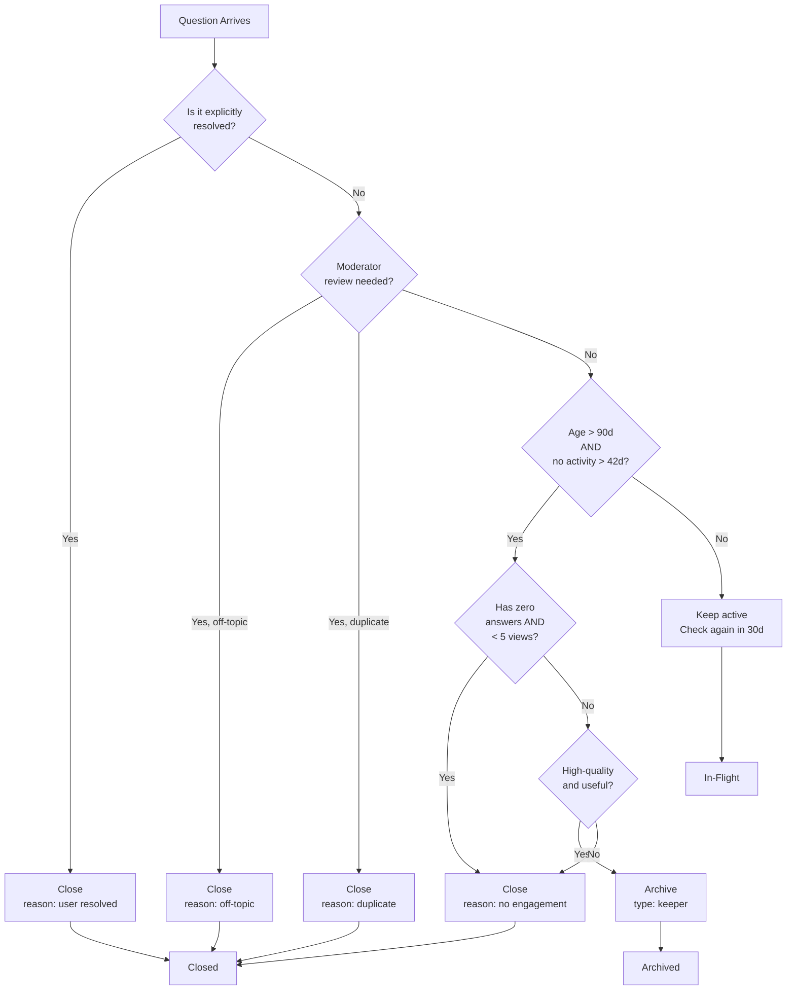

*Report — a draft (2026-09-05), published to cairn by the dispatch flow. Reference material, not a daily reflection.*

## Question Closure and Archive Logic

A question sits in Jimbo's vault until something makes it move. Either a user resolves it. Or it rots. Right now, rot is a feeling, not a policy. This is the policy.

The useful distinction is between **closed** and **archived**. Closure means we've settled it: someone answered, or the question itself became obsolete, or no one cared enough to revive it after six weeks of silence. Archive means we've hidden it because it's no longer useful to keep surfaced, but we won't delete it—some keeper questions deserve a quiet corner, not a trash bin.

## Closure Criteria

A question is eligible to close when at least one of these is true:

**Age + Staleness**: The question is older than 90 days AND has received no activity (answer, comment, follow-up) in the last 42 days. Age alone is not enough—a new question sitting unanswered for 91 days should still be open. But age plus staleness is a real signal.

**Explicit Resolution**: A user marked the question resolved. They saw an answer that worked, or the problem went away, or they no longer need help. This is synchronous and gets closure immediately, no waiting.

**Moderator Close**: A moderator reviewed it and decided it's off-topic, spam, or a duplicate. Close immediately with a reason attached.

**Zero-Engagement Threshold**: The question is older than 180 days, received zero answers, and has been viewed fewer than 5 times. At that point it's academic—it's not going to generate value. Close with reason "no activity".

## Archive Criteria

A question moves to archive (but stays retrievable) when:

**High-Quality Unanswered**: The question is well-written, on-topic, and likely to help future readers, but it has no accepted answer and is older than 120 days. This is a "keeper"—it's valuable for search, but we stop pushing it to the active view.

**Resolved, But Worth Keeping**: Someone answered and the asker resolved it, but the question-answer pair is general enough that it's a reference resource. Stay archived until someone searches for it again.

**Historical Value**: A moderator flags it as "reference" or "landmark"—it's a good example of how Jimbo works or how we handle a class of questions. Keep it archived, surfaced only through search.

## Decision Logic

Here's the flow:

## Manual vs. Automatic

**Automatic** (no human needed):
- Explicit user resolution → close immediately
- Age 180d + zero answers + < 5 views → close immediately
- Age 90d + 42d staleness → close (automatic, but notify user once before final)

**Manual Review Required**:
- Moderator close (off-topic, duplicate, harmful)
- High-quality unanswered → archive (requires human judgment that it's a keeper)
- Edge cases (famous questions, linked elsewhere, part of an epic) → check before closing

## Edge Cases

**The Landmark Question**: A question with zero answers but high citation and search traffic. It's not stale; it's a reference. Moderator flags as "landmark" → archive, stays surfaced in search.

**The Answered-But-Unaccepted**: Someone gave a good answer, but the asker never came back to accept it. After 60 days, consider auto-closing with "answer available" flag. The asker can reopen if they disagree.

**The Duplicate Bridge**: A question that is a duplicate but serves as a search bridge to the canonical version. Archive it with a link back, don't close it outright.

**The Overfitting Edge Case**: A question so specific (e.g., "how do I fix this error on line 47 of my script?") that it will never help anyone else. After 42 days of staleness, close with "too specific" rather than keep it active forever.

**The Keeper That's Wrong**: A high-quality archived question where the accepted answer is now outdated or incorrect. Moderator can unarchive it back to active to collect new answers, or pin a correction to the top.

## Staleness Score (Future)

Right now we have binary signals: active or not, answered or not. If we want to get smarter, add a staleness score:

- Days since last activity: +1 point per 7 days over 42 days
- Zero answers: +2 points
- Low view count (< 5 total): +1 point
- Answers exist but not accepted: -1 point
- Recent high-engagement answer: -3 points

Close at score >= 5. Archive at score 3-4 if high-quality. This lets us weight different signals instead of treating them as hard thresholds.

## The Boundary Rule

Closure is final. Archive is not. Once a question closes, assume you will not reopen it—make sure the reason is sound and the user has been notified. Archive is a "hidden but not gone" state. A user searching or a moderator reviewing can still bump an archived question back to active if new information arrives.

This keeps the active feed honest without deleting knowledge.

